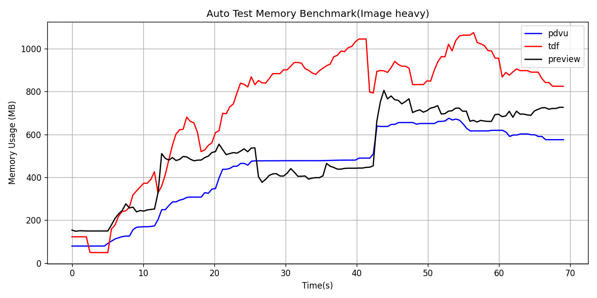
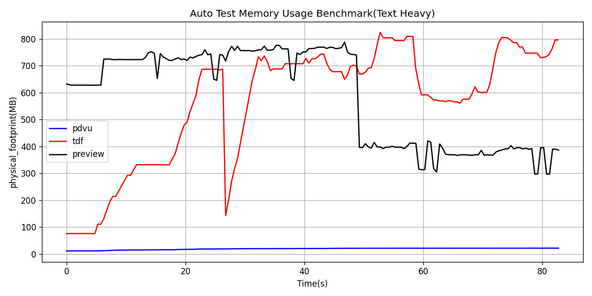

# pdvu


<u>__This project is still in progress, large changes to the codebase expected__</u>

**pdvu** is a high-performance, terminal-based PDF viewer written in C++. 

## Features
- Low memory footprint
    - No TUI library
    - No prefetching
    - Cache only heavy pages
- Multithreaded rendering
- Tempfile and Posix Shared Memory Transmission
- Page Zooming and Panning
- text searching (in a future update)


## Requirements

* **MacOS (have not tested on linux platform yet)**
* **C++23 Compiler**
* **CMake** 3.31
* **MuPDF** (Built as a static library)
* **Terminal Emulator** with Kitty Graphics Protocol support. E.g. Kitty, Ghostty, Wezterm...

## Installation & Build

`pdvu` links statically against MuPDF. You must have the MuPDF source available in the `external` directory.

1.  **Clone the repository:**
    ```bash
    git clone https://github.com/Eddrick-23/pdvu.git
    cd pdvu
    ```

2.  **Prepare MuPDF:**
    Place the MuPDF source code in `external/mupdf` and build the static libraries (`libmupdf.a`, `libmupdf-third.a`).
    ```bash
    mkdir external && cd external
    git clone --recursive https://git.ghostscript.com/mupdf.git
    cd mupdf
    make HAVE_X11=no HAVE_GLUT=no prefix=./build/release install
    ```

3.  **Build pdvu:**
    ```bash
    #Run from project root
    cd ../.. 
    
    # Configure
    cmake -S . -B build/release -DCMAKE_BUILD_TYPE=Release

    # Build
    cmake --build build/release

    # Run
    ./build/release/pdvu <path to pdf>
    ```

## [Benchmarks](benchmark/benchmarks.md)
The following pdfs were used for testing
* Text heavy: [CLRS 3rd edition](https://www.cs.mcgill.ca/~akroit/math/compsci/Cormen%20Introduction%20to%20Algorithms.pdf), 5.5mb, 1313 pages
* Image heavy: [Principles of Marketing 5th edition](https://api.pageplace.de/preview/DT0400.9781292443805_A44086878/preview-9781292443805_A44086878.pdf), 164.6mb, 743 pages. (Note that link goes to a free preview sample, not the one used in benchmarks)

Viewers used
* Preview GUI viewer on Mac, Version 11.0 (1069.7.1)
* [tdf](https://github.com/itsjunetime/tdf) TUI viewer, Version 0.5.0, with -p 1 to limit prerendering
* pdvu with caching enabled, tempfile based transmission, 1 worker thread

Test Machine:
- Chip:	Apple M3 Pro
- Total Number of Cores: 11 (5 performance and 6 efficiency)
- Memory: 18 GB
- Software Version: Sequoia 15.7.1

This is an automated benchmark using a python script with predifined inputs and rss measured at 0.5s intervals




<table>
<tr>
<td>

## Auto test (Image heavy)

|  | MIN | MAX | Mean |
|--------|-----|-----|------|
| pdvu | 79.41 | 675.84 | 445.11 |
| tdf | 49.03 | 1075.30 | 734.42 |
| preview | 148.45 | 805.78 | 507.80 |

</td>
<td>

## Auto test (Text heavy)

|  | MIN | MAX | Mean |
|--------|-----|-----|------|
| pdvu | 24.69 | 38.42 | 28.57 |
| tdf | 91.33 | 1000.22 | 748.08 |
| preview | 203.55 | 331.09 | 301.84 |
</td>
</tr>
</table>

