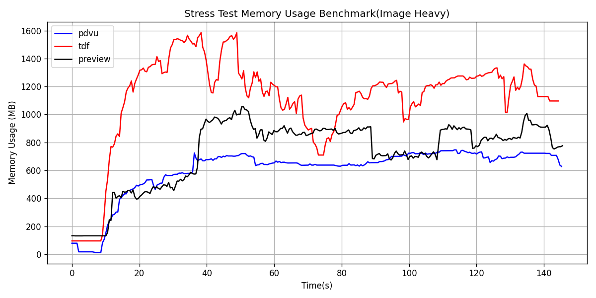
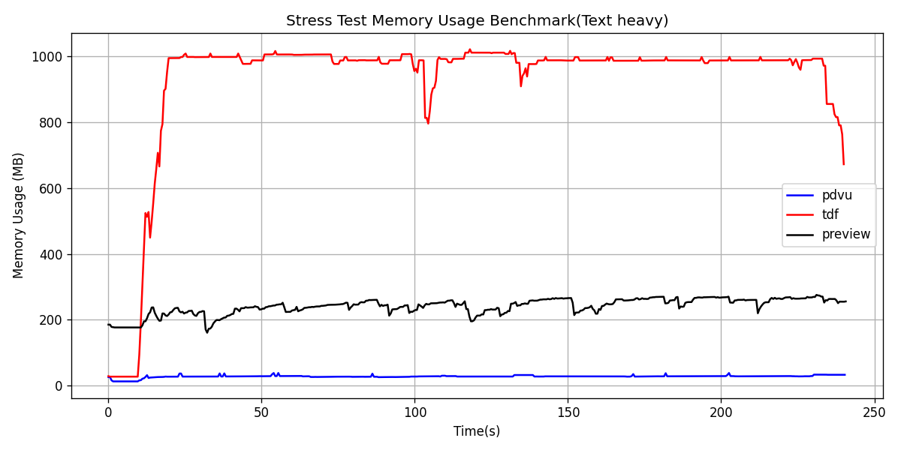

# Benchmarks
NOTE: Memory usage for TUI tools (tdf, pdvu) reflects process-only usage. The display overhead (rendering textures, window management) is offloaded to the host Terminal Emulator. In contrast, Preview figures include the full GUI stack cost, which may add extra memory overhead.
## Stress test Memory Benchmark
The benchmark is done by loading the pdf and the memory tracker, waiting for 10 seconds, then holding down the key to cycle through pages, all the way until we reach the last page, then cycling back. Memory usage is tracked and plotted as follows.

This is to simulate a worst case scenario of loading pages rapidly as a user scrolls through. The automated benchmark is more indicative of actual performance

<table>
<tr>
<td>

## Stress test(Image heavy)

| Metric | MIN | MAX | Mean |
|--------|-----|-----|------|
| pdvu | 12.19 | 746.83 | 601.54 |
| tdf | 95.63 | 1585.45 | 1112.48 |
| preview | 131.67 | 1055.23 | 727.34 |

</td>
<td>

## Stress test(Text heavy)

| Metric | MIN | MAX | Mean |
|--------|-----|-----|------|
| pdvu | 13.03 | 38.58 | 27.98 |
| tdf | 27.44 | 1021.14 | 925.94 |
| preview | 160.70 | 275.56 | 240.92 |

</td>
</tr>
</table>

### More to be added in the future...
